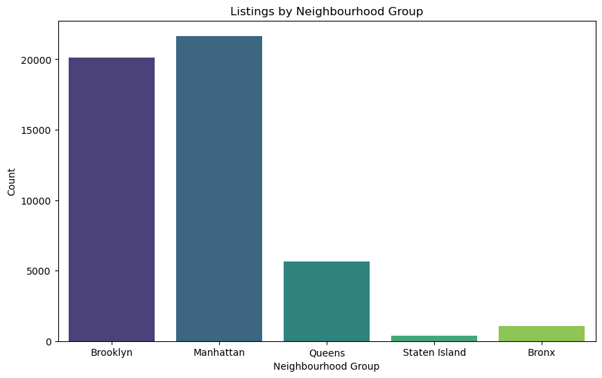
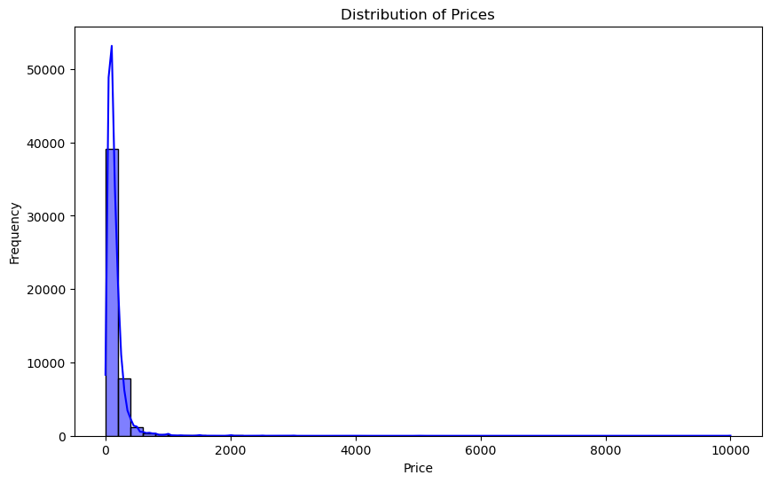
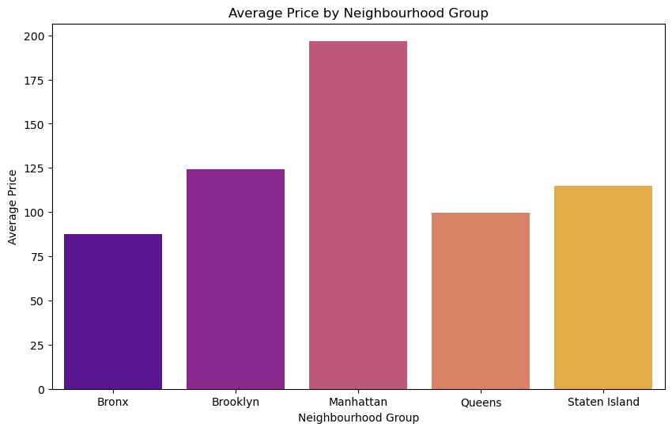
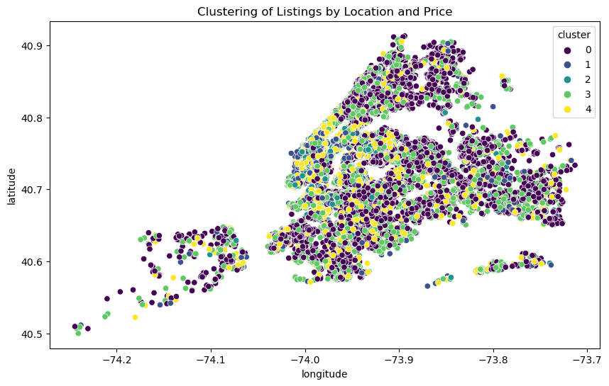

# Airbnb NYC Listings Analysis

## Overview
This project analyzes the New York City Airbnb dataset to uncover insights about pricing, availability, and neighbourhood trends. The dataset contains detailed information about Airbnb listings in NYC, including location, price, room type, and availability. The goal of this analysis is to understand the factors influencing Airbnb prices and availability across different neighbourhoods in NYC.


## Dataset
The dataset used in this project is the [New York City Airbnb Open Data](https://www.kaggle.com/datasets/dgomonov/new-york-city-airbnb-open-data) from Kaggle. It contains the following key columns:
- `id`: Unique identifier for each listing.
- `name`: Name of the listing.
- `host_id`: Unique identifier for the host.
- `neighbourhood_group`: Neighbourhood group (e.g., Manhattan, Brooklyn).
- `neighbourhood`: Neighbourhood name.
- `latitude`: Latitude coordinates of the listing.
- `longitude`: Longitude coordinates of the listing.
- `room_type`: Type of room (e.g., Entire home/apt, Private room, Shared room).
- `price`: Price per night.
- `minimum_nights`: Minimum number of nights required to book.
- `number_of_reviews`: Total number of reviews.
- `last_review`: Date of the last review.
- `reviews_per_month`: Number of reviews per month.
- `calculated_host_listings_count`: Number of listings by the host.
- `availability_365`: Number of days the listing is available in a year.


## Problem Description
The goal of this analysis is to explore and visualise trends in Airbnb listings in NYC. Specifically, we aim to:
1. Understand the distribution of listings by neighbourhood and room type.
2. Analyse price trends and availability across different neighbourhoods.
3. Identify correlations between variables such as price, availability, and number of reviews.
4. Use clustering to group listings based on location and price.


## Notebook Overview
The Jupyter Notebook includes the following sections:

### 1. Data Loading
- The dataset is loaded using `pandas` from the [AB_NYC_2019.csv](AB_NYC_2019.csv) file.

### 2. Data Cleaning
- Irrelevant columns (`id`, `host_name`, `last_review`) are dropped.
- Missing values in `reviews_per_month` are filled with `0`.
- Duplicate rows are removed.

### 3. Exploratory Data Analysis (EDA)
- Summary statistics for numerical columns (e.g., price, availability, number of reviews).
- Count of unique values for categorical columns (e.g., `neighbourhood_group`, `room_type`).

### 4. Data Visualization
- Distribution of listings by neighbourhood group and room type.
- Distribution of prices and average prices by neighbourhood group and room type.
- Distribution of availability and average availability by neighbourhood group.
- Correlation matrix to show relationships between numerical variables.

### 5. Outlier Detection
- Outliers in the `price` column are identified using a boxplot.
- Listings with prices above $500 are removed to focus on more typical listings.

### 6. Clustering
- Listings are clustered into 5 groups based on location (`latitude`, `longitude`) and price using KMeans clustering.

### 7. Predictive Modelling
- A linear regression model is trained to predict prices based on features like `latitude`, `longitude`, `minimum_nights`, `number_of_reviews`, `reviews_per_month`, and `availability_365`.
- The model's performance is evaluated using Mean Squared Error (MSE), which is 7208.17.


## Key Insights
### 1. Listings by Neighbourhood
- Manhattan has the highest number of listings (21,661), followed by Brooklyn (20,104).
- Staten Island has the fewest listings, indicating it’s less popular for Airbnb.

### 2. Price Distribution
- Most listings are priced between $50 and $200, with some outliers above $500.
- After removing outliers (prices above $500), the distribution becomes more focused on affordable listings.
- Manhattan has the highest average price ($196.88), while Staten Island has the lowest ($114.81).

### 3. Room Types
- Entire homes/apartments are the most common and tend to be more expensive, with an average price of $211.79.
- Shared rooms are the cheapest, making them a good option for budget travellers.

### 4. Availability
- Listings in Staten Island are the most available (average availability > 200 days/year).
- Listings in Manhattan are the least available, likely due to high demand.

### 5. Clustering
- KMeans clustering grouped listings into 5 clusters based on latitude, longitude, and price.
- This clustering can help identify areas with similar pricing and location characteristics.


## Visualisations
Here are some key visualisations from the analysis:
1. Listings by Neighbourhood Group:
   
2. Price Distribution:
   
3. Average Price by Neighbourhood Group:
   
4. Clustering of Listings by Location and Price:
   


## Modelling
### Linear Regression
- A linear regression model was built to predict listing prices based on features like latitude, longitude, and availability.
- The model achieved a Mean Squared Error (MSE) of 7208.17.


## Conclusion
This analysis provides valuable insights into Airbnb listings in NYC, helping potential hosts and guests make informed decisions. The visualisations highlight key trends in pricing, availability, and neighbourhood preferences. The clustering and predictive modeling further enhance our understanding of the data.


## Future Work
- Explore additional features such as proximity to landmarks or public transportation.
- Build more advanced predictive models (e.g., Random Forest, Gradient Boosting) to improve price prediction accuracy.
- Analyse seasonal trends in pricing and availability.


## Dependencies
The project requires the following Python libraries:
- `pandas`
- `numpy`
- `matplotlib`
- `seaborn`
- `scikit-learn`
- `jupyter`

These can be installed using the `requirements.txt` file:
```bash
pip install -r requirements.txt
```


## Acknowledgments
- Dataset: [New York City Airbnb Open Data](https://www.kaggle.com/datasets/dgomonov/new-york-city-airbnb-open-data) from Kaggle.
- Libraries: `pandas`, `numpy`, `matplotlib`, `seaborn`, `scikit-learn`.

